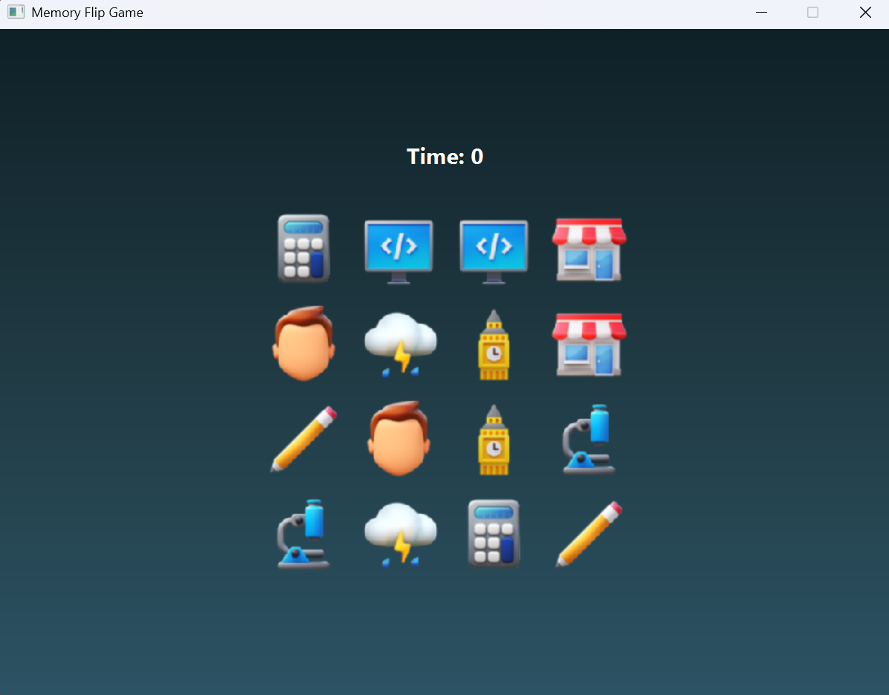

# Memory Card Flip Game

A simple memory card flip game built with JavaFX and Maven. Players flip cards to find matching pairs before time runs out.

## 📚 Table of Contents

- [Features](#features)
- [How to Run](#how-to-run)
- [Technologies Used](#technologies-used)
- [Screenshots](#-screenshots)
- [Demo Video](#-demo-video)
- [How to Play](#how-to-play)
- [Known Issues](#known-issues)
- [Future Improvements](#future-improvements)
- [Acknowledgments](#acknowledgments)
- [Contact](#contact)

## Features
- Card flip animations
- Countdown timer
- Responsive UI
- Match detection logic

## How to Run

1. Clone the repository:  
   `git clone https://github.com/Rabsa-110/memory-flip-game.git`

2. Open in IntelliJ IDEA.

3. Make sure Java 17+ and JavaFX are installed.

4. Run using Maven:  
   `mvn clean javafx:run`

## Technologies Used
- Java 17+
- JavaFX
- Maven
- FXML
- Scene Builder

## 📷 Screenshots

### 🎮 Start Screen

### 🎚️ Level Screen

### 🃏 Flipping Cards

### 🏁 Game Over

## 🎬 Demo Video

[▶️ Watch Gameplay Demo on YouTube](https://youtu.be/9K3ZDDmhlFY?si=Ws2WtTBx3IJ_1efz)

## How to Play

- Flip two cards by clicking on them.
- Match pairs to clear the board.
- Beat the timer before it runs out!

## Known Issues

- Timer sometimes doesn't stop though all the cards are flipped successfully.
- For the medium level(5 X 5), if the joker card is flipped then the game      will not stop.

## Future Improvements

- Add sound effects.
- Implement high score leaderboard.

## Acknowledgments

- Thanks to JavaFX community for great resources.
- Inspired by classic memory card games.

## Contact
Email: tariqrabsa@gmail.com
